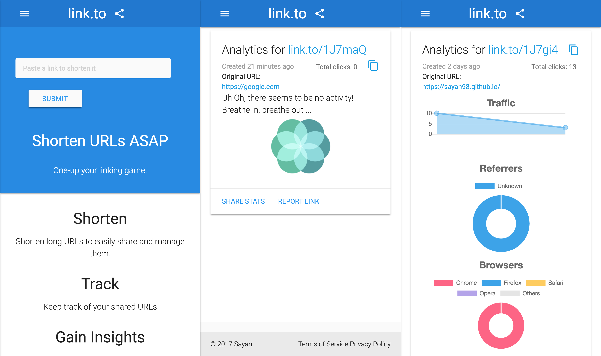

# :zap: Link.To
URL Shortener using Flask and Redis

## :zap: What does LinkTo do?
Give it a link and it will shorten it for you. It'll throw in some analytics too for your pleasure.

## :zap: What does it have?
- URL Shortening
- Analytics (fancy charts with [ChartJS](http://www.chartjs.org/))
- Multi-user (using [ACID](https://en.wikipedia.org/wiki/ACID))
- Concurrency (with [Gunicorn](http://docs.gunicorn.org/en/stable/) WSGI)

## :zap: How do I run it?
To run LinkTo locally, you will need [Pipenv](https://github.com/pypa/pipenv), Python3 and [Redis](https://github.com/antirez/redis).

- Install dependencies with `pipenv install`
- Fire up a redis-server with `redis-server`. It ships with sensible deafults!
- Finally, let's run the app `pipenv run python app.py` and witness your handiwork!
- That's all!

## :zap: Why/How was it built?
Link.To was built using Flask with Redis in the database layer as a means to explore key-value store type of (NoSQL) databases.

Icons made by <a href="http://www.freepik.com" title="Freepik">Freepik</a> from <a href="https://www.flaticon.com/" title="Flaticon">www.flaticon.com</a> is licensed by <a href="http://creativecommons.org/licenses/by/3.0/" title="Creative Commons BY 3.0" target="_blank">CC 3.0 BY</a>
